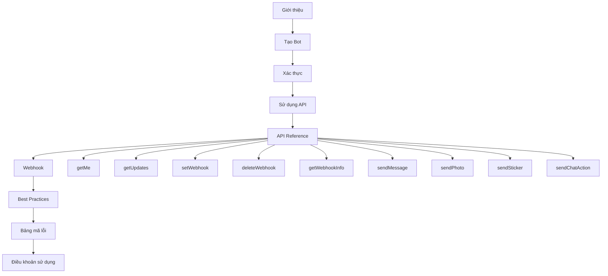
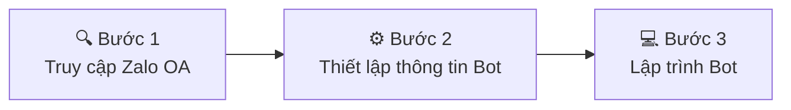
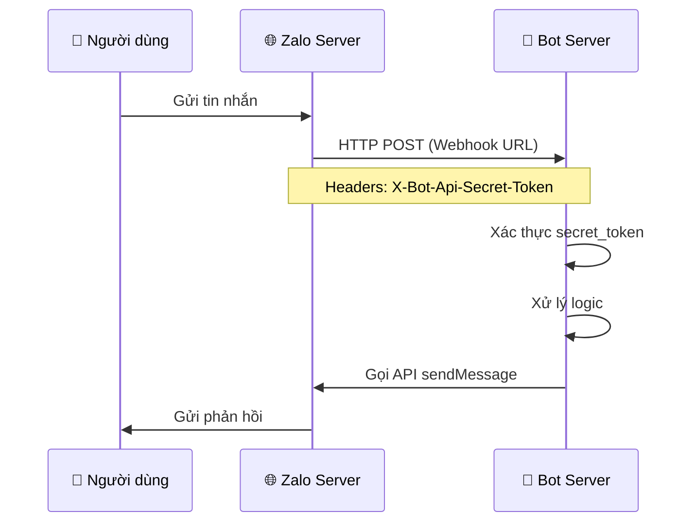
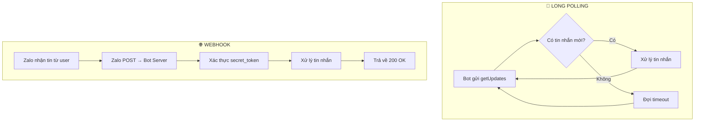
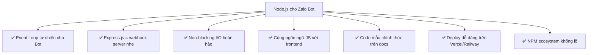
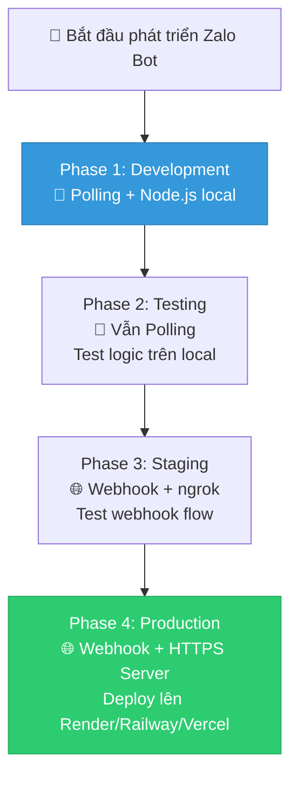

# 📱 Phân Tích Chi Tiết Zalo Bot Platform

> **Nguồn:** [https://bot.zaloplatforms.com/docs/](https://bot.zaloplatforms.com/docs/)  
> **Ngày phân tích:** 03/03/2026  
> **Đơn vị phát triển:** Công Ty TNHH Zalo Platforms (MST: 0318836678, thành lập 17/02/2025)

---

## 📋 Mục lục

1. [Tổng quan nền tảng](#1-tổng-quan-nền-tảng)
2. [Quy trình tạo Bot](#2-quy-trình-tạo-bot)
3. [Cơ chế xác thực](#3-cơ-chế-xác-thực)
4. [Sử dụng API](#4-sử-dụng-api)
5. [API Reference chi tiết](#5-api-reference-chi-tiết)
6. [Cơ chế Webhook](#6-cơ-chế-webhook)
7. [So sánh Polling vs Webhook](#7-so-sánh-polling-vs-webhook)
8. [So sánh Node.js vs Python](#8-so-sánh-nodejs-vs-python)
9. [Khuyến nghị cuối cùng](#9-khuyến-nghị-cuối-cùng)

---

## 1. Tổng quan nền tảng

### Zalo Bot là gì?
Zalo Bot là một **tài khoản tự động (bot)** hoạt động trên nền tảng Zalo, cho phép doanh nghiệp hoặc nhà phát triển **tương tác tự động** với người dùng thông qua tin nhắn ngay trong cửa sổ chat.

### Mục đích sử dụng
| Mục đích | Mô tả |
|----------|-------|
| **Tự động hóa (Automation)** | Triển khai giải pháp tự động hóa trên nền tảng Zalo |
| **Gửi thông báo** | Xây dựng quy trình gửi thông báo tự động |
| **Tích hợp hệ thống** | Kết nối với ERP, CRM, CDP và các hệ thống nội bộ |
| **CSKH** | Tự động phản hồi đơn hàng, hỗ trợ khách hàng |
| **Khảo sát** | Tự động gửi và thu thập khảo sát |
| **Cảnh báo** | Gửi thông tin cảnh báo real-time |

### Cấu trúc tài liệu



---

## 2. Quy trình tạo Bot

### 3 bước tạo bot



#### Bước 1: Truy cập Zalo OA
- Mở ứng dụng **Zalo**
- Tìm kiếm OA **"Zalo Bot Manager"**
- Chọn **"Tạo bot"** trong menu cửa sổ chat → truy cập ứng dụng **Zalo Bot Creator**

#### Bước 2: Thiết lập thông tin Bot
- Nhập tên Bot (bắt buộc bắt đầu bằng tiền tố `Bot`, VD: `Bot MyShop`)
- Nhấn **"Tạo Bot"** để xác nhận
- Hệ thống gửi **Thông tin Bot** và **Bot Token** qua tin nhắn Zalo

> [!IMPORTANT]
> Tên Bot **BẮT BUỘC** phải bắt đầu bằng tiền tố `Bot`, ví dụ: `Bot MyShop`, `Bot Support`

#### Bước 3: Lập trình Bot
- Hỗ trợ: **Node.js**, **Python**, hoặc nền tảng **No-code**
- Hai cơ chế giao tiếp:
  - **Long Polling** (`getUpdates`)
  - **Webhook** (`setWebhook`)

---

## 3. Cơ chế xác thực

### Bot Token

| Thuộc tính | Chi tiết |
|-----------|---------|
| **Định dạng** | `12345689:abc-xyz` |
| **Thời hạn** | Không hết hạn (cho đến khi reset thủ công) |
| **Cách reset** | Truy cập Zalo Bot Creator → Thiết lập → Làm theo hướng dẫn |
| **Thông báo** | Token mới gửi qua tin nhắn Zalo |

### Cách sử dụng Token

Token được nhúng trực tiếp vào URL API:

```
https://bot-api.zaloplatforms.com/bot<BOT_TOKEN>/<functionName>
```

**Ví dụ:**
```
https://bot-api.zaloplatforms.com/bot123456789:abc123xyz/getMe
```

> [!CAUTION]
> Bot Token **KHÔNG HẾT HẠN** cho đến khi bạn chủ động reset. Hãy bảo mật Token cẩn thận, **TUYỆT ĐỐI không commit vào public repo**.

---

## 4. Sử dụng API

### Định dạng URL
```
https://bot-api.zaloplatforms.com/bot<BOT_TOKEN>/<functionName>
```

### Phương thức HTTP hỗ trợ
- `GET` — cho truy xuất dữ liệu
- `POST` — cho thay đổi/ghi/cập nhật dữ liệu

### Cách truyền tham số

| Phương thức | Mô tả | Use case |
|-------------|--------|----------|
| **Query String** | `?chat_id=123456&text=Hello` | Truyền params đơn giản |
| **application/x-www-form-urlencoded** | Form tiêu chuẩn | POST đơn giản |
| **application/json** | JSON payload | Gửi dữ liệu có cấu trúc |
| **multipart/form-data** | Upload file | Tải lên ảnh, tài liệu |

### Phản hồi từ API

Luôn trả về JSON với cấu trúc:
```json
{
  "ok": true,        // true = thành công, false = thất bại
  "result": { ... }, // Dữ liệu trả về (khi ok=true)
  "description": "", // Mô tả lỗi (khi ok=false)
  "error_code": 0    // Mã lỗi (khi ok=false)
}
```

> [!NOTE]
> - Tất cả truy vấn phải sử dụng encoding **UTF-8**
> - Tên API (method name) **phân biệt chữ hoa/thường**
> - Tất cả truy vấn phải qua giao thức **HTTPS**

---

## 5. API Reference chi tiết

### 5.1 `getMe` — Kiểm tra Bot Token

| Thuộc tính | Giá trị |
|-----------|---------|
| **URL** | `https://bot-api.zaloplatforms.com/bot${BOT_TOKEN}/getMe` |
| **Method** | POST |
| **Parameters** | Không yêu cầu |

```json
// Sample Response
{
  "ok": true,
  "result": {
    "id": "1459232241454765289",
    "account_name": "bot.VDKyGxQvc",
    "account_type": "BASIC",
    "can_join_groups": false
  }
}
```

### 5.2 `getUpdates` — Nhận tin nhắn mới (Long Polling)

| Thuộc tính | Giá trị |
|-----------|---------|
| **URL** | `https://bot-api.zaloplatforms.com/bot${BOT_TOKEN}/getUpdates` |
| **Method** | POST |
| **Parameters** | `timeout` (optional) |

> [!WARNING]
> - `getUpdates` **KHÔNG hoạt động** nếu đã thiết lập Webhook (phải gọi `deleteWebhook` trước)
> - Hai cơ chế này **loại trừ lẫn nhau** (mutually exclusive)
> - Chỉ nên dùng cho **môi trường development/local**
> - Với **production**, nên dùng **Webhook** để tránh bỏ lỡ event

### 5.3 `setWebhook` — Cấu hình Webhook URL

| Thuộc tính | Giá trị |
|-----------|---------|
| **URL** | `https://bot-api.zaloplatforms.com/bot${BOT_TOKEN}/setWebhook` |
| **Method** | POST |

**Parameters:**

| Param | Mô tả |
|-------|-------|
| `url` | Webhook URL (nên sử dụng HTTPS) |
| `secret_token` | Token bảo mật để xác thực request từ Zalo |

```json
// Sample Response
{
  "ok": true,
  "result": {
    "url": "https://your-webhookurl.com",
    "updated_at": 1749538250568
  }
}
```

### 5.4 `deleteWebhook` — Xóa cấu hình Webhook

| Thuộc tính | Giá trị |
|-----------|---------|
| **URL** | `https://bot-api.zaloplatforms.com/bot${BOT_TOKEN}/deleteWebhook` |
| **Method** | POST |
| **Parameters** | Không yêu cầu |

### 5.5 `getWebhookInfo` — Lấy thông tin Webhook hiện tại

| Thuộc tính | Giá trị |
|-----------|---------|
| **URL** | `https://bot-api.zaloplatforms.com/bot${BOT_TOKEN}/getWebhookInfo` |
| **Method** | POST |
| **Parameters** | Không yêu cầu |

```json
// Sample Response
{
  "ok": true,
  "result": {
    "url": "https://your-webhookurl.com",
    "updated_at": 1749633372026
  }
}
```

### 5.6 `sendMessage` — Gửi tin nhắn văn bản

| Thuộc tính | Giá trị |
|-----------|---------|
| **URL** | `https://bot-api.zaloplatforms.com/bot${BOT_TOKEN}/sendMessage` |
| **Method** | POST |

**Parameters:**

| Param | Mô tả |
|-------|-------|
| `chat_id` | ID cuộc hội thoại |
| `text` | Nội dung tin nhắn |

```json
// Sample Response
{
  "ok": true,
  "result": {
    "message_id": "82599fa32f56d00e8941",
    "date": 1749632637199
  }
}
```

### 5.7 `sendPhoto` — Gửi tin nhắn hình ảnh

| Param | Mô tả |
|-------|-------|
| `chat_id` | ID cuộc hội thoại |
| `photo` | File ảnh (multipart/form-data) |
| `caption` | Chú thích ảnh (optional) |

### 5.8 `sendSticker` — Gửi Sticker

| Param | Mô tả |
|-------|-------|
| `chat_id` | ID cuộc hội thoại |
| `sticker` | URL sticker từ [stickers.zaloapp.com](https://stickers.zaloapp.com/) |

### 5.9 `sendChatAction` — Hiển thị trạng thái

| Param | Mô tả |
|-------|-------|
| `chat_id` | ID cuộc hội thoại |
| `action` | `typing` (văn bản) hoặc `upload_photo` (ảnh - sắp ra mắt) |

---

## 6. Cơ chế Webhook

### Cách hoạt động



### Cấu trúc Webhook Request

- **URL:** `https://your-webhookurl.com`
- **Method:** POST
- **Headers:** `X-Bot-Api-Secret-Token: <secret_token>`
- **Content-Type:** application/json

### Webhook Events (event_name)

| Event | Mô tả |
|-------|-------|
| `message.text.received` | Nhận tin nhắn văn bản |
| `message.image.received` | Nhận tin nhắn hình ảnh |
| `message.sticker.received` | Nhận tin nhắn Sticker |
| `message.unsupported.received` | Tin nhắn chưa hỗ trợ xử lý |

### Cấu trúc dữ liệu Webhook

```json
{
  "ok": true,
  "result": {
    "message": {
      "from": {
        "id": "6ede9afa66b88fe6d6a9",
        "display_name": "Ted",
        "is_bot": false
      },
      "chat": {
        "id": "6ede9afa66b88fe6d6a9",
        "chat_type": "PRIVATE"    // PRIVATE hoặc GROUP (sắp ra mắt)
      },
      "text": "Xin chào",
      "message_id": "2d758cb5e222177a4e35",
      "date": 1750316131602
    },
    "event_name": "message.text.received"
  }
}
```

### Message Object chi tiết

| Trường | Mô tả |
|--------|-------|
| `from` | Thông tin người gửi (id, display_name, is_bot) |
| `chat` | Thông tin cuộc trò chuyện (id, chat_type) |
| `chat_type` | `PRIVATE` (cá nhân) hoặc `GROUP` (nhóm - sắp ra mắt) |
| `text` | Nội dung tin nhắn text |
| `photo` | Dữ liệu ảnh (nếu là image) |
| `caption` | Chú thích ảnh |
| `sticker` | Dữ liệu sticker |
| `message_id` | ID tin nhắn duy nhất |
| `date` | Timestamp (milliseconds) |

### Sample Webhook Code (Express.js)

```javascript
app.use(express.json());
const WEBHOOK_SECRET_TOKEN = 'your-secret-token';

app.post("/webhooks", async (req, res) => {
  const secretToken = req.headers["x-bot-api-secret-token"];
  
  if (secretToken !== WEBHOOK_SECRET_TOKEN) {
    return res.status(403).json({ message: "Unauthorized" });
  }
  
  let body = req.body;
  // Handle your logic here
  
  res.json({ message: "Success" });
});

app.listen(port, () => {
  console.log(`Server running at http://localhost:${port}`);
});
```

> [!TIP]
> **Đối tượng đặc biệt:** Nếu tài khoản người gửi thuộc nhóm đối tượng đặc biệt (trẻ em, người khuyết tật, v.v.), hệ thống sẽ gửi event `message.unsupported.received` thay vì nội dung tin nhắn, nhằm tuân thủ quy định pháp luật.

---

## 7. So sánh Polling vs Webhook

### 7.1 Bảng so sánh toàn diện

| Tiêu chí | 🔄 Long Polling (`getUpdates`) | 🌐 Webhook (`setWebhook`) |
|----------|-------------------------------|---------------------------|
| **Cơ chế** | Bot chủ động gửi request định kỳ để lấy tin nhắn mới | Zalo Server chủ động push tin nhắn đến Bot khi có event |
| **Độ trễ (Latency)** | ⚠️ Phụ thuộc vào khoảng thời gian polling | ✅ Gần như real-time (< 1 giây) |
| **Tài nguyên server** | ⚠️ Tốn tài nguyên (request liên tục dù không có tin nhắn) | ✅ Tiết kiệm (chỉ nhận request khi có event) |
| **Bỏ lỡ event** | ⚠️ Có thể bỏ lỡ nếu polling interval dài hoặc bot bị crash | ✅ Zalo tự gửi, ít bị mất |
| **Hạ tầng yêu cầu** | ✅ Không cần domain/HTTPS, chạy local được | ⚠️ Cần server có domain HTTPS |
| **Bảo mật** | ✅ Không cần expose endpoint ra internet | ⚠️ Cần expose endpoint + xác thực `secret_token` |
| **Scalability** | ❌ Khó scale (mỗi bot = 1 polling loop) | ✅ Dễ scale (chỉ cần tăng workers) |
| **Mục đích theo Zalo** | Development/Testing/Local | **Production** |
| **SDK hỗ trợ** | ✅ `node-zalo-bot` + `python-zalo-bot` | ✅ `node-zalo-bot` + `python-zalo-bot` |
| **Mutually Exclusive** | ⚠️ Không hoạt động nếu đang dùng Webhook | ⚠️ Cần `deleteWebhook` để chuyển sang Polling |

### 7.2 Workflow so sánh



### 7.3 Phân tích chi tiết

#### Long Polling — Khi nào dùng?
- ✅ **Development & Testing** trên máy local
- ✅ Bot cá nhân, quy mô nhỏ, ít người dùng
- ✅ Khi chưa có server/domain HTTPS
- ✅ Prototype, PoC (Proof of Concept)

#### Webhook — Khi nào dùng?
- ✅ **Production** (khuyến nghị chính thức từ Zalo)
- ✅ Bot có lượng người dùng lớn
- ✅ Cần phản hồi real-time
- ✅ Cần tích hợp với hệ thống enterprise (CRM, ERP)
- ✅ Cần xử lý đồng thời nhiều request

> [!IMPORTANT]
> ### 🏆 Kết luận: **WEBHOOK** là lựa chọn đúng cho bot ổn định
> 
> **Chính Zalo đã khuyến nghị rõ ràng trong documentation:**
> > *"Chỉ nên sử dụng API getUpdates để chạy local, trong môi trường development, thử nghiệm. Với môi trường production, bạn nên thiết lập Webhook để tránh bỏ lỡ event."*
> 
> Webhook là cơ chế duy nhất phù hợp cho production vì:
> 1. **Real-time** — phản hồi ngay lập tức
> 2. **Không bỏ lỡ event** — Zalo chủ động push
> 3. **Tiết kiệm tài nguyên** — không request thừa
> 4. **Dễ scale** — tăng workers khi cần

---

## 8. So sánh Node.js vs Python

### 8.1 SDK chính thức

| Tiêu chí | 🟢 Node.js (`node-zalo-bot`) | 🐍 Python (`python-zalo-bot`) |
|----------|------------------------------|-------------------------------|
| **NPM/PyPI** | [node-zalo-bot](https://www.npmjs.com/package/node-zalo-bot) | [python-zalo-bot](https://pypi.org/project/python-zalo-bot/) |
| **Hỗ trợ Polling** | ✅ | ✅ |
| **Hỗ trợ Webhook** | ✅ | ✅ |
| **Tài liệu chính thức** | ✅ Code mẫu trên docs | ✅ Code mẫu trên docs |

### 8.2 So sánh ngôn ngữ cho Zalo Bot

| Tiêu chí | 🟢 Node.js | 🐍 Python |
|----------|-----------|----------|
| **Event-driven I/O** | ✅ Xuất sắc (single-thread, non-blocking) | ⚠️ Cần async/await (asyncio) |
| **Xử lý concurrent** | ✅ Tự nhiên với event loop | ⚠️ GIL limitation cho multi-thread |
| **Webhook server** | ✅ Express.js cực kỳ nhẹ và nhanh | ✅ Flask/FastAPI cũng ổn |
| **Tốc độ xử lý HTTP** | ✅ Rất nhanh cho I/O-bound tasks | ⚠️ Chậm hơn cho I/O |
| **Hệ sinh thái chatbot** | ✅ Phong phú (Telegram, Discord, Slack SDK) | ✅ Phong phú |
| **Memory footprint** | ✅ Nhẹ (~30-50MB) | ⚠️ Nặng hơn (~50-100MB) |
| **Hosting/Deploy** | ✅ Vercel, Railway, Render, AWS Lambda | ✅ Render, Railway, AWS Lambda |
| **Code mẫu trên Docs** | ✅ **Express.js sample code** trực tiếp trên docs | ✅ Có SDK reference |
| **AI/ML tích hợp** | ⚠️ Hạn chế hơn | ✅ Mạnh (OpenAI, LangChain, etc.) |
| **Độ phổ biến cho Bot** | ✅ Rất phổ biến | ✅ Phổ biến |

### 8.3 Phân tích ưu nhược điểm chi tiết

#### Node.js — Ưu điểm rõ ràng cho Zalo Bot



1. **Event-driven architecture**: Node.js chạy trên event loop, hoàn hảo cho chatbot (nhận event → xử lý → trả kết quả)
2. **Non-blocking I/O**: Gọi API Zalo, database, AI service... tất cả đều async, không block main thread
3. **Express.js cực nhẹ**: Webhook server chỉ cần vài dòng code, khởi động nhanh, memory thấp
4. **Code mẫu chính thức**: Zalo docs sử dụng Express.js cho sample code webhook
5. **Deploy đa nền tảng**: Vercel (edge functions), Railway, Render đều native support Node.js
6. **Package ecosystem**: `node-zalo-bot` SDK chính thức + hàng triệu package trên npm

#### Python — Khi nào nên chọn?

1. **AI-heavy bot**: Nếu bot cần NLP, ML, OpenAI integration nặng
2. **Data processing**: Xử lý data phức tạp với pandas, numpy
3. **Team quen Python**: Team chỉ biết Python, không biết JS
4. **FastAPI alternative**: FastAPI cũng async rất tốt cho webhook

> [!IMPORTANT]
> ### 🏆 Kết luận: **Node.js** là lựa chọn tối ưu
> 
> **Lý do chính:**
> 1. **Zalo docs dùng Express.js** cho sample code webhook — đây là dấu hiệu rõ ràng rằng platform được thiết kế với Node.js là ngôn ngữ ưu tiên
> 2. **Event-driven = chatbot**: Kiến trúc Node.js hoàn toàn phù hợp với bản chất của chatbot (nhận → xử lý → trả)
> 3. **Non-blocking I/O**: Khi bot cần gọi nhiều API (Zalo, AI, DB) đồng thời, Node.js xử lý tốt hơn nhờ native async
> 4. **Lightweight**: Tiết kiệm chi phí hosting, boot time nhanh
> 5. **Deploy dễ dàng**: Nhiều nền tảng hosting miễn phí/giá rẻ native support Node.js
> 
> **Ngoại lệ duy nhất:** Chọn Python nếu bot của bạn **chủ yếu** xử lý AI/ML nặng (NLP processing, custom model inference)

---

## 9. Khuyến nghị cuối cùng

### Chiến lược phát triển tối ưu



### Tech Stack khuyến nghị

| Layer | Công nghệ | Lý do |
|-------|-----------|-------|
| **Runtime** | Node.js 20+ | Event-driven, performance, SDK support |
| **Framework** | Express.js | Nhẹ, nhanh, sample code chính thức |
| **SDK** | `node-zalo-bot` | SDK chính thức của Zalo |
| **Cơ chế nhận tin** | Webhook (production) | Real-time, không bỏ lỡ event |
| **Dev tools** | ngrok | Tunnel HTTPS cho dev local |
| **Hosting** | Render / Railway / Vercel | HTTPS miễn phí, auto-deploy |
| **Database** | PostgreSQL / MongoDB | Tùy nhu cầu |
| **AI (optional)** | OpenAI API / Anthropic | Tích hợp AI response |

### Lưu ý quan trọng

> [!WARNING]
> **Hai cơ chế Polling và Webhook là LOẠI TRỪ NHAU (mutually exclusive)**
> - Khi đã `setWebhook`, `getUpdates` sẽ **KHÔNG hoạt động**
> - Muốn chuyển lại Polling, phải gọi `deleteWebhook` trước
> - Không thể dùng cả hai cùng lúc

> [!NOTE]
> **Tính năng sắp ra mắt:**
> - `chat_type: "GROUP"` — Bot tương tác trong nhóm chat
> - `upload_photo` action cho `sendChatAction`
> - Platform mới (thành lập 02/2025), expect nhiều API mới

---

## Tóm tắt 1 dòng

> **🎯 Dùng Webhook + Node.js (Express.js) cho production, Long Polling chỉ dùng khi dev/test local.**
